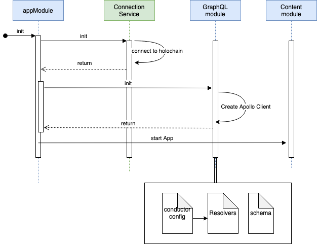

# ng-graphql-hc-starter

# loading sequence

## Holochain setup

currently uses holochain version 0.47-alpha1.  
enter the dna directory and use nix shell to run the conductor :

- nix-shell
- hc package
- hc run

## UI setup

in another shell enter the ui directory.  
npm install / yarn install  
npm start / yarn start  

## TODO
 - functionality to signal back new users to the UI (apollo subscriptions)
